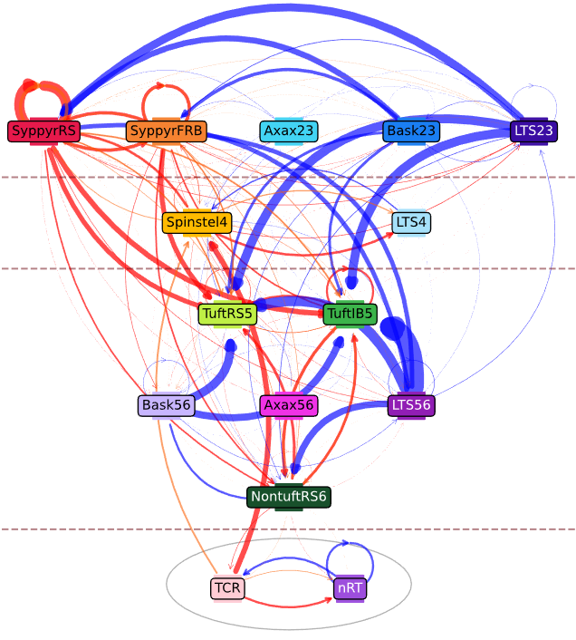

# Thalamo-cortical loop
the repository for thalamo-cortical loop modelling



# 🧠 Cortical Column Simulation (NEURON + Python)

We model the thalamo-cortical loop using the [NEURON](https://neuron.yale.edu/neuron/) neurosimulator. We model excitatory and inhibitory neurons and visualise there activities.

---

## 📁 Project contents

| File                       | Description                                                                                                                |
| -------------------------- | -------------------------------------------------------------------------------------------------------------------------- |
| `cortical_column.py`       | Main script of the simulation: imports all submodules and runs simulation and does visualisation.                          |
| `create_HHNeuron_group.py` | Defines Neuron class `HHNeuron` (Hodgkin-Huxley) and groups of neurons creation functions.                                 |
| `connect_functions.py`     | Contains functions of neurons connection: `connect_exc` (excitatory projections) and `connect_inh` (inhibitory).           |
| `create_connections.py`    | Setup synaptic connections between all neuronal groups (thalamus, cortical layers).                                        |
| `thalamus_stimulation.py`  | Exeternal stimulation of neurons of thalamus via `NetStim`.                                                                |
| `visualization.py`         | Results visualisation: membraine potentials, spike times, heatmaps etc.                                                    |

---

## 🧠 Biological components

* **TCR (Thalamocortical relay cells)** — thalamus excitatory neurons
* **nRT (nucleus Reticularis Thalami)** — thalamus inhibitory neurons
* **Cortical layers**:

  * L2/3 SyppyrRS
  * L2/3 SyppyrFRB
  * L4 Spinstel
  * L5 TuftRS
  * L5 TuftIB
  * L6 NontuftRS

---

## ⚙️ Dependencies

* Python 3.8+
* [NEURON](https://www.neuron.yale.edu/neuron/download)
* `numpy`
* `matplotlib`

Installation of dependencies:

```bash
pip install numpy matplotlib
```

NEURON installation: [official documents](https://neuron.yale.edu/neuron/download).

---

## 🚀 Запуск

Run the main script:

```bash
python cortical_column.py
```

The results visualisation are presented as graphs: spike-times, membraine potentials.

---

## 📊 Options

* Modelling neurons and their groups HH-neurons
* Excitatory and inhibitory neurons
* External stimulation `NetStim`
* Record and analysis of spikes
* Flexible setup of weights and delays and parameters of synapses
* Visualisation of neurons activities 

---

## 📎 Examples


---


